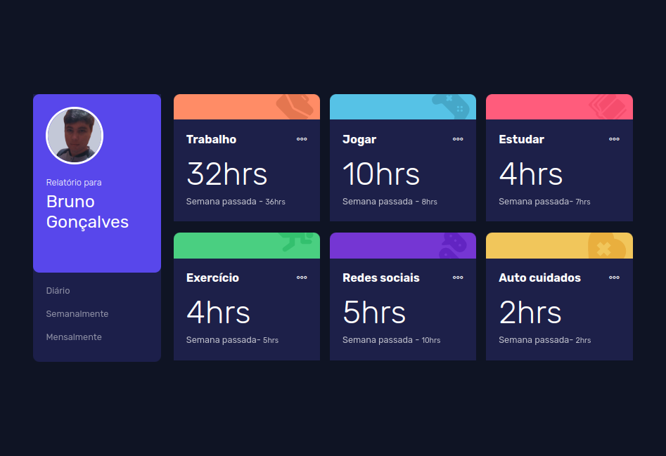

# FrontEnd Mentor - Time-Dashboard

  

    <a href="#layout">Layout</a> | 
    <a href="#projeto">Projeto</a> |
    <a href="#tecnologias">Tecnologias</a> |
    <a href="#autor">Autor</a> |
  

  
O front end mentor é um site onde existe vários desafios de desenvolvimento front-end para programadores de todos os níveis de habilidades.

Acesse o site é comece a desenvolver vários templates com seus desafios <a href="https://www.frontendmentor.io/">FrontEndMentor</a>.

 

## Layout

 

## Deploy

<a href="https://personal-report.vercel.app/">Projeto online</a>

 

## Projeto

Nesta aplicação a ideia é construir um tipo de dashboard onde mostra relatórios diários, semanais é mensais da rotina de uma pessoa. Tempo que se trabalhou durante o dia, o tempo que a pessoa passou jogando na semana entre outros.

O que se aprendi com este desafio:

- Consumir arquivos Json
- Usamos o método ForEach para percorrer elementos HTML que buscamos no JavaScript, é também que nós ajudou a percorrer o Index do Array Json para pegar dados especificos para consumir no front-end.

 

## Tecnologias

- Javascript
- HTML
- CSS
- Phosphos Icons
- Git é Github

 

## Autor

Bruno Gonçalves Ferreira

